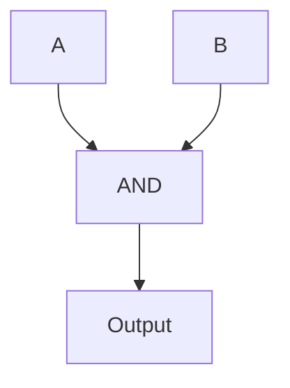

## Logic Operations
Boolean logic is where you can perform operation on binary value and binary variables.

There are three basic logic operations (also called Boolean Functions):
- AND: donated by a dot (.)
	- E.g. A.B
- OR: donated by a plus (+)
	- E.g. A+B
- NOT: denoted by an overbar ($^-$)
	- E.g. A$^-$B
### Examples
### Truth Tables
## Logic Gates
### AND

### OR
### NOT
## Transistors
### CMOS NOT
### NAND
### NOR
## Resolving logic
%%(11/03 Slides)%%
## Notations
### Operator Notation
### Function Notation
### Basic Operation Laws
### Other Laws
## Truth Table -> Circuit

