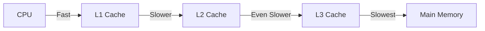

## Memory Hierarchy
- "In board" memory
	- Registers
	- Cache
	- Main memory
- "Outboard" storage
	- Magnetic disk (HDD)
	- Solid-state disk (SDD)
	- "Flash" devices
	- Optical storage (CD, DVD)
- Off-line sotrage
	- Magnetic tape
	- DNA?
### Trade-offs
$C=Capacity$
$P= Performance$
$\$=Cost\ (per\ bit)$
#### Relationship
- Cost increases, Performance increases
- Capacity increases, Cost decreases
- Capacity increases, Performance decreases
#### Trade-offs in heirarchy
%%6%%
## Cache
Cache is a small amount of memory that we can access extremely fast. These are generally located on the CPU and sit between normal main memory and the CPU.
### Cache and Main Memory
When we fetch data we try get it from cache.

### Operations
1. The CPU requests contents of a memory location (usually a word)
2. First we check the cache to see if the word is available
	1. If it is present, this is a cache hit. We will get this data from the cache which is a fast operation and deliver it to the CPU.
	2. If it isn't present, this is a cache miss. We need to read the required block from main memory to cache, and deliver from cache to CPU. This is a slow operation.
Caches include tags to identify which block of main memory is in each cache slot. (Note that since the cache is smaller it cannot hold all the memory blocks from main memory so tags are used to identify which memory blocks are in the cache)
### Flowchart
%%12%%
### Cache Miss
%%13%%
### Reading from cache
To read from the cache we simply read from the cache slot that contains the block.
### Writing to cache
- Write-through policy
	- When writing, write to both cache and main memory
- Write-back policy
	- Only write to the cache initially. If the relevant block of data in the cache is being evicted though, then write back its updated contents to Main Memory first. %%Find out what evicted means%%
Managing cache memory when you have multiple processors is tricky as we will need to ensure all caches have communication and ensure they have the same image of the main memory.
## Main Memory
The main memory can store instructions and data. This is made from "semiconductors" on a silicon chip. This is memory is called RAM because it's "Random Access Memory". It is the heart of the "Fetch-Execute Cycle". Both data on which a program operates, as well as the instructions of the program itself, are stored in main memory
### IC
%%20%%
### DRAM
This stands for Dynamic Ram.

Bits are stored as charges in capacitors which is volatile (will disappear). Charges will leak if it does not get refreshed. As such, refresher circuits are required.

This is generally simpler to make and smaller per bit and as a result is less expensive but it is somewhat slower.

These are used for Main Memory.
### SRAM
This stand for Static RAM.

Bits are stored as on/off switches which is volatile. However, charges do not leak and as such do not need refreshing. They are made up of flip flops.

This is generally more complex to make and larger per bit and as a result is more expensive but it is somewhat faster.

These are used for Cache Memory.
## ROM
This stands for Read Only Memory.

This is nonvolatile storage
