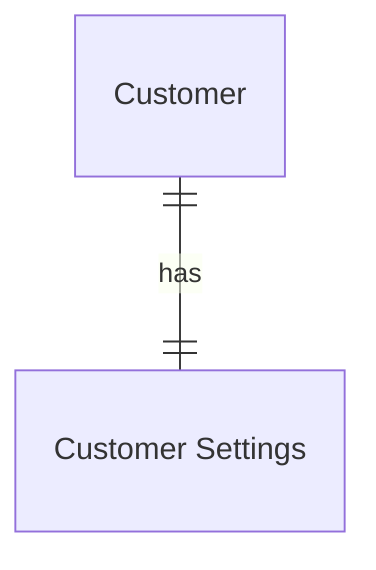
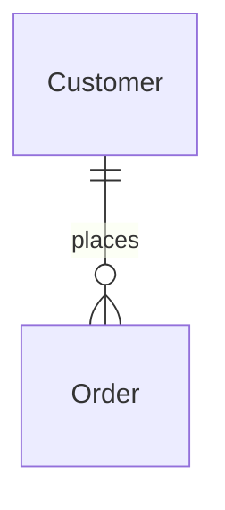
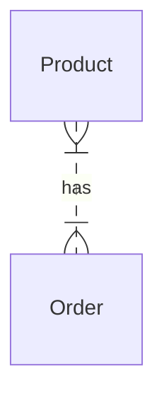

## ERM
An entity-relationship model (ER model) is a way to visually represent the data in a database and the relationships between different pieces of that data.

The three main components are:
- Entities
- Relationships
- Attributes
### Entities
Entities represent real-world objects or concepts. These are usually in the form of tables.
### Relationships
Relationships refer to how tables are connected with one another, this is done with [[Database diagram#Primary Key|Primary Keys]] and [[Database diagram#Foreign Key|Foreign Keys]]
### Attributes
Attributes are the specific details/properties that an entity has. These have specific data types.
## ERD
### Primary Key
A primary key is an attribute that identifies uniquely, every record within a certain table so queries for this specific record return only this one.
#### Composite Key
Composite Keys are when two or more attributes are required to identify every record in the table.
### Foreign Key
Foreign keys are primary keys of another entity that are present in a different one. These values represent a record in another entity.
## Relationships
### One to One

### One to Many

### Many to Many

## Cardinalities
![[Cardinalities.png]]